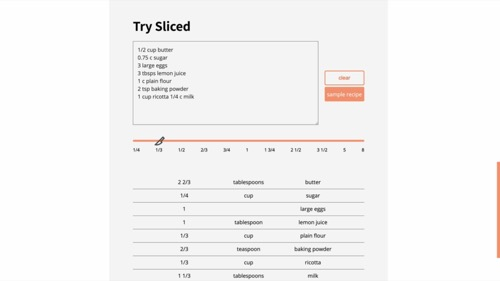

# Portfolio

This is the repository for Software Engineer Rachel Reilly's portfolio site.

## Tech Stack

- React.js
- Next.js
- SASS
- Node.js
- Express.js
- [rss-parser](https://www.npmjs.com/package/rss-parser)
- [dom-purify](https://github.com/cure53/DOMPurify)
- [node-mailjet](https://github.com/mailjet/mailjet-apiv3-nodejs)

## Codebase 

### /api

This folder contains a simple Express.js REST API with two endpoints, `/api/feed` & `/api/mail`

#### index.js

Sets up Express.js app

#### mailRouter.js

Sets up the `POST` endpoint at `api/mail`. This uses Mailjet to send data from the contact form to my email. 

#### feedRouter.js

Sets up a `GET` endpoint at `api/feed` to deliver the data from [https://rachelrly.medium.com/](https://rachelrly.medium.com)

#### getMediumArticles.js

Fetches and parses the RSS feed, preparing the Blog posts for the client

### /client

#### /pages

Contains the layout for the routes on the app: `/`, `/blog`, `/projects`

#### /components

Contains the components that are used in `/pages` and elsewhere. In each folder, the default of the `index.js` is a stand-alone component, and the child components are not to be used outside their folder. 

##### /Banner

Contains the code for the animation on the home page

##### /Projects

Contains the content displayed in the `/projects` route

##### /Blog

Contains the content displayed in the `/blog` route

##### Card.js

A HOC that wraps the list items for projects and blogs

##### layout.js

A HOC that wraps the layout of the whole app

#### /styles

##### styles.sass

Imports all of the SASS partials into one file

##### _globals.sass

Holds all of the style variables for the project

##### _mixins.sass

Contains mixins for layout and brand style

##### _blog.sass, _project.sass, _about.sass

Contains the styles for their respective sections

## Project Overview

### Sliced

Scale your recipes with Sliced

[Project](https://sliced.rachanastasia.vercel.app/) ◇ 
[Repository](https://github.com/rachelrly/sliced) ◇ 
[Blog post](https://rachelrly.medium.com/a-tale-of-three-string-parsing-algorithms-ed62a13bc62b)

### Spaced Repetition

A fullstack language learning app that uses the spaced repetition technique

[Project](https://spaced-repetition-dun.vercel.app/) ◇ 
[Repository](https://github.com/rachelrly/spaced-repetition-server)

### One Dimensional Chess

A static two-player One Dimensional Chess game

[Project](https://one-d-chess.vercel.app/) ◇ 
[Repository](https://github.com/Rachanastasia/one-dimensional-chess)

### GraphQL Bookshelf

A fullstack GraphQL project that allows users to view my virtual bookshelf and filter books by author, rating, or genre

[Project](https://bookshelf.rachanastasia.vercel.app/) ◇ 
[Repository](https://github.com/rachelrly/graphql-bookshelf-api)

### Loan Calculator

A simple loan calculator that utilizes the `useReducer()` hook to calculate the new value on change rather than on submit

[Project](https://loan-calculator-two.vercel.app/) ◇ 
[Repository](https://github.com/rachelrly/loan-calculator) ◇ 
[Blog post](https://rachelrly.medium.com/usestate-vs-usereducer-9bbfca768f51)

### Init

A social media platform for developers to share their work. Created for the team capstone at Thinkful's Software Engineering Immersion program

[Project](https://init-rachel.vercel.app/) ◇ 
[Repository](https://github.com/Rachanastasia/init) 
